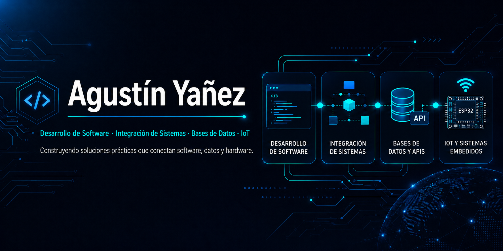

  <a href="./README.md">English</a> | <strong>Español</strong>

  

---

## 👨‍💻 Sobre mí

Soy desarrollador de software y profesional de integración de sistemas, radicado en Buenos Aires, Argentina. Desarrollo soluciones prácticas que conectan **aplicaciones web, APIs, bases de datos y sistemas embebidos**, con experiencia trabajando en entornos productivos críticos.

- 🔭 Desarrollo una plataforma modular de **automatización con ESP32 para hidroponía indoor**
- 🧩 Trabajo en integraciones entre **Moodle y Zoom Meeting SDK**
- 🎯 Me enfoco en la **mantenibilidad, confiabilidad y mejora continua**

---

## 🛠️ Tecnologías

  
  
  
  
  
  
  
  

  
<strong>Herramientas y plataformas adicionales</strong>

   

  

    
    
    
    
    
    
    
    
    
    
    
    
  

---

## 🚀 Proyectos destacados

### 🎓 Integración educativa Moodle + Zoom

Integración basada en plugins entre **Moodle y Zoom Meeting SDK**, diseñada para clases virtuales y evaluaciones en línea.

**Principales funcionalidades:**

- Flujo de acceso y autenticación a reuniones
- Validación de cámara y micrófono
- Overlays personalizados, temporizadores y notificaciones
- Reglas de acceso para cuestionarios
- Compatibilidad entre diferentes versiones de Moodle
- Comunicación segura entre componentes PHP y JavaScript

> **Estado:** Proyecto grupal · Repositorio para portfolio en preparación

---

### 🎬 Sistema de gestión para cines

Aplicación ASP.NET Core MVC para administrar películas, salas, funciones, usuarios y reservas.

**Principales funcionalidades:**

- Roles de administrador y cliente
- Gestión de películas, salas y funciones
- Flujo de reservas
- Validaciones por clasificación de edad
- Integración con Entity Framework y SQL Server

[Ver repositorio](https://github.com/Agus-yanez/ProyectoCineORT)
> **Estado:** Proyecto académico · Repositorio público
---

### 🌱 Automatización hidropónica con ESP32

Subsistema modular de automatización de relés para un entorno de hidroponía indoor, desarrollado con **ESP32, PlatformIO, Arduino Framework y C++ orientado a objetos**.

**Actualmente implementado:**

- Arquitectura de relés orientada a objetos
- Administración centralizada de relés
- Activaciones manuales y temporizadas
- Estados seguros durante el arranque
- Bloqueo de relés
- Protecciones por tiempo mínimo de apagado y máximo de encendido
- Interfaz de comandos por puerto serie
- Configuraciones de seguridad según el tipo de actuador

**Integraciones planificadas:**

- Múltiples horarios por relé
- Reglas de automatización basadas en sensores
- Configuración persistente
- RTC y hora de red
- Wi-Fi y API REST
- Registro de eventos y alertas

[Ver repositorio](https://github.com/Agus-yanez/RelaysControl)

> **Estado:** Público · Desarrollo activo

---

### 🗄️ Base de datos para call center de telecomunicaciones

Proyecto en SQL Server para gestionar clientes, prospectos, servicios y tickets de soporte.

**Principales funcionalidades:**

- Stored procedures con validaciones de negocio
- Funciones y triggers
- Manejo de transacciones
- Historial de estados de tickets
- Lógica relacionada con SLA
- Códigos y mensajes de error estructurados

> **Estado:** Proyecto académico · Repositorio en preparación

---

## 📫 Contacto

Estoy abierto a oportunidades relacionadas con desarrollo de software, integración de sistemas, IoT y automatización.

- LinkedIn: [Agustín Yañez](https://www.linkedin.com/in/agustin-yañez-4a9392112/)

---

### ¡Gracias por visitar mi perfil!

