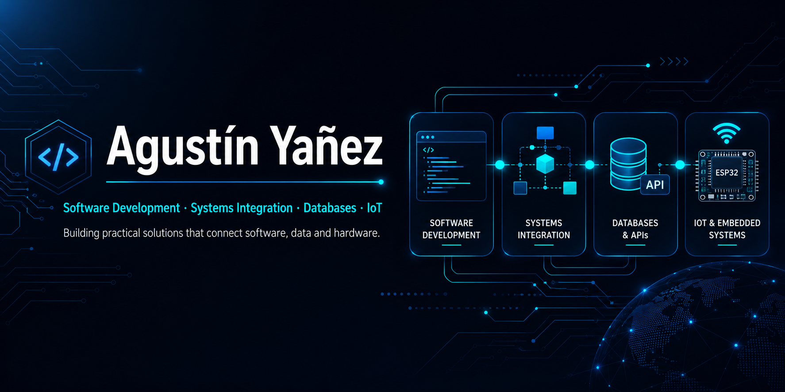

  <strong>English</strong> | <a href="./README.es.md">Español</a>

  

---

## 👨‍💻 About Me

I'm a software developer and systems integration professional based in Buenos Aires, Argentina. I build practical solutions that connect **web applications, APIs, databases, and embedded systems**, with experience supporting critical production environments.

- 🔭 Building a modular **ESP32 automation platform for indoor hydroponics**
- 🧩 Contributed to and maintain the portfolio version of a public **Moodle + Zoom Meeting SDK** integration, with documented QA and security hardening
- 🎯 Focused on **maintainable architecture, reliability, and continuous improvement**

---

## 🛠️ Tech Stack

  
  
  
  
  
  
  
  

  
<strong>Additional tools and platforms</strong>

   
  

    
    
    
    
    
    
    
    
    
    
    
    
  

---

## 🚀 Featured Projects

### 🎓 Moodle + Zoom Education Integration

Moodle Quiz Access Rule integrating **Zoom Meeting SDK** for supervised educational sessions.

**Main features:**

- Meeting access and authentication flow
- Camera and microphone device validation
- Configurable supervision rules and waiting states
- Reconnection handling
- Secure PHP ↔ JavaScript communication
- Moodle 4.5 / 5.0 compatibility validation
- Automated quality and security checks with GitHub Actions

[View repository](https://github.com/Agus-yanez/moodle-zoom-education-integration)

> **Status:** Team project · Public portfolio repository

---

### 🗄️ Telecom Call Center Database

SQL Server database project for managing **customers, prospects, telecom services, support tickets, SLA rules, and ticket lifecycle operations**.

**Main features:**

- Stored procedures with business validations and structured error handling
- Functions, transactions, and a set-based notification trigger
- Controlled ticket state transitions and status history
- SLA calculation excluding time spent waiting for the customer
- Database-level integrity constraints and supporting indexes
- Executable smoke tests and end-to-end regression tests

[View repository](https://github.com/Agus-yanez/telecom-call-center-database)

> **Status:** Group academic project · Reviewed and published as a portfolio repository

---

### 🌱 ESP32 Hydroponics Automation

Modular relay automation subsystem for an indoor hydroponics environment, developed with **ESP32, PlatformIO, Arduino Framework, and object-oriented C++**.

**Currently implemented:**

- Object-oriented relay architecture
- Centralized relay management
- Manual and timed activations
- Safe startup states
- Relay locking
- Minimum OFF-time and maximum ON-time protections
- Serial command interface
- Actuator-specific safety configurations

**Planned integrations:**

- Multiple schedules per relay
- Sensor-based automation rules
- Persistent configuration
- RTC and network time
- Wi-Fi and REST API
- Logging and alerts

[View repository](https://github.com/Agus-yanez/RelaysControl)

> **Status:** Public · Active development

---

### 🎬 Cinema Management System

ASP.NET Core MVC application for managing movies, rooms, screenings, users, and reservations.

**Main features:**

- Administrator and customer roles
- Movie, room, and screening management
- Reservation workflow
- Age-rating validations
- Entity Framework and SQL Server integration

[View repository](https://github.com/Agus-yanez/ProyectoCineORT)

> **Status:** Academic project · Public repository

---

## 📫 Let's Connect

I'm open to software development, systems integration, IoT, and automation opportunities.

- LinkedIn: [Agustín Yañez](https://www.linkedin.com/in/agustin-yañez-4a9392112)

---

### Thanks for visiting my profile!

